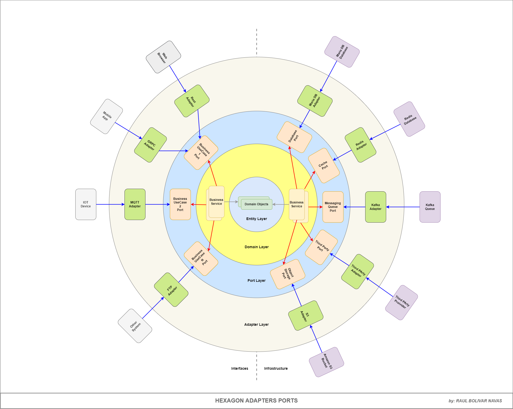

# Franchise Network Management Application Services

The Franchise Network Management project is a Spring Boot application that provides a RESTful API for managing franchises, branches, and products. The application allows users to create franchises, add branches to franchises, manage products in branches, and track product stock levels.

### Operations

- Create a franchise
- Add a branch to a franchise
- Add and remove products from a branch
- Modify the stock of a product in a branch
- Get the top product of a branch

### Diagram de Operaciones


### How to run the project

1. Clone the repository
2. Navigate to the project directory
3. Select the desired profile:
   - `local` for local development
   - `dev` for development (no shared by author, use secrets, or keyvault)
   - `test` for testing (no shared by author, use secrets, or keyvault)
   - `prod` for production (no shared by author, use secrets, or keyvault)
4. Run the following command to start the application:
   ```
   ./gradlew bootRun --args='--spring.profiles.active=dev'
   ```
5. The application will start on port 8080 by default
6. You can access the API documentation at `http://localhost:8080/webjars/swagger-ui/index.html`

### Docker Compose

The project includes a `docker-compose.yml` file that can be used to run the application in a Docker container. To run the application using Docker Compose, follow these steps:

1. Make sure you have Docker and Docker Compose installed on your machine.
2. Navigate to the project directory.
3. Run the following command to start the application:
   ```
   docker-compose up
   ```
4. The application will start on port 8080 by default.


### API Documentation

The API documentation is available at the following file path: ***swagger.json***

### Postman Collection

The Postman collection is available at the following file path: ***franchise.postman_collection.json***

### Test Cases

The test cases are located in the `src/test/java/com/network/franchise/...` directory. The test cases are written using JUnit 5 and can be run using the following command:
```
./gradlew test
```

### Code Coverage

The code coverage report is generated using JaCoCo and can be found in the `build/reports/tests/test/index.html` directory. You can open the `index.html` file in your web browser to view the code coverage report.
```
./gradlew clean test jacocoTestReport
```


### Amazon ECR & Docker

The application is containerized using Docker and can be deployed to Amazon Elastic Container Registry (ECR). The following commands can be used to build and push the Docker image to ECR:
- docker build -t franchise-network-management:latest .

The application is containerized using Docker and can be deployed to Amazon Elastic Container Registry (ECR). The following commands can be used to build and push the Docker image to ECR:
- aws ecr create-repository --repository-name franchise-network-management

Tag the Docker image with the ECR repository URI:
- docker tag franchise-network-management:latest 221986013097.dkr.ecr.us-east-1.amazonaws.com/franchise-network-management:latest

Build the Docker image:
- aws ecr get-login-password --region us-east-1 | docker login --username AWS --password-stdin 221986013097.dkr.ecr.us-east-1.amazonaws.com

Push the Docker image to ECR:
- docker push 221986013097.dkr.ecr.us-east-1.amazonaws.com/franchise-network-management:latest

### Deployment with Terraform in AWS

The deployment of the application in AWS is done using Terraform. The Terraform code is located in the `terraform` directory. The Terraform code provisions the following resources:

- VPC
- Subnets
- Security Groups
- EC2 Instances
- RDS Instances
- Load Balancers

### Pattern Hexagonal Architecture

The project follows the Hexagonal Architecture pattern, which separates the application into different layers. The main layers are:

- **Domain Layer**: Contains the business logic and domain entities.
- **Application Layer**: Contains the application services and use cases.
- **Infrastructure Layer**: Contains the implementation details, such as repositories and external services.



### Example Flow Chart Use Case Considerations, Understanding, Design and Acceptance Criteria


### Author

- **[Raul Bolivar Navas](https://www.linkedin.com/in/rasysbox)** - [GitHub](https://github.com/raulrobinson/franchise-network-management)

### License

This project is licensed under the MIT License. See the [LICENSE](LICENSE) file for details.
